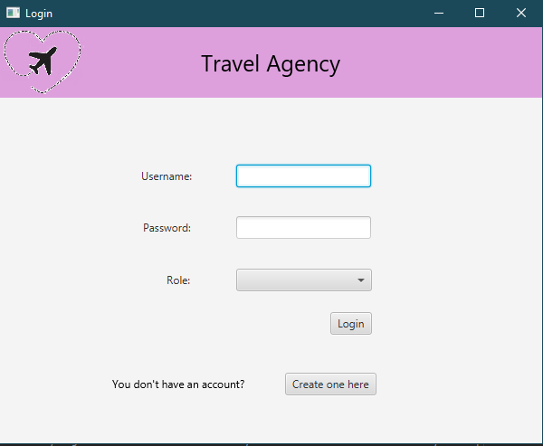
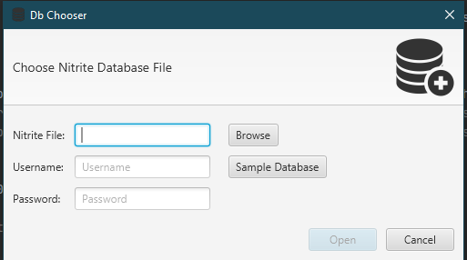

# Travel Agency Application
A JavaFX Application that represents a booking application using the following technologies:
* [Java 15 or 16](https://www.oracle.com/java/technologies/javase-downloads.html)
* [JavaFX](https://openjfx.io/openjfx-docs/) (as GUI)
* [Maven](https://maven.apache.org/) / [Gradle](https://gradle.org/) (as build tools)
* [Nitrite Java](https://www.dizitart.org/nitrite-database.html) (as Database)

## Prerequisites
To be able to install and run this project, please make sure you have installed Java 15. Otherwise, the setup will note work!
To check your java version, please run `java -version` in the command line.

To install a newer version of Java, you can go to [Oracle](https://www.oracle.com/java/technologies/javase-downloads.html) or [OpenJDK](https://jdk.java.net/).

It would be good if you also installed Maven to your system. To check if you have Maven installed run `mvn -version`.

If you need to install it, please refer to this [Maven tutorial](https://www.baeldung.com/install-maven-on-windows-linux-mac).

Make sure you install JavaFX SDK on your machine, using the instructions provided in the [Official Documentation](https://openjfx.io/openjfx-docs/#install-javafx). Make sure to export the `PATH_TO_FX` environment variable, or to replace it in every command you will find in this documentation from now on, with the `path/to/javafx-sdk-15.0.1/lib`.

The application uses JavaFX 15.

_Note: you can download version 15 of the javafx-sdk, by replacing in the download link for version 16 the `16` with `15`._

## Setup & Run
To set up and run the project locally on your machine, please follow the next steps.

### Clone the repository
Clone the repository using:
```git
git clone https://github.com/fis2021/Travel_Agency
```

### Verify that the project Builds locally
Open a command line session and `cd Travel_Agency`.
If you have installed all the prerequisites, you should be able to run any of the following commands:
```
mvn clean install
```

### Open in IntelliJ IDEA
To open the project in IntelliJ idea, you have to import it as a Maven project.
After you import it, in order to be able to run it, you need to set up your IDE according to the [official documentation](https://openjfx.io/openjfx-docs/). Please read the section for `Non-Modular Projects from IDE (Non-Modular with Maven)`.
If you managed to follow all the steps from the tutorial, you should also be able to start the application by pressing the run key to the left of the Main class.

### Run the project using Inteliij idea
In order to run the project through Inteliij, you may have to go to ` File -> Project structure -> Project ` and select `version 15` for Project SDK and `SDK Defaul(15 - Text blocks)`.
Also, go to `Run -> Edit Configurations ` and make sure the `java 15 JDK` is selected and that the main class is specified - `org.fis.student.Main`. You will have to check the working 
directory to be the correct one, and, also, add VM options: `--module-path "path_to_fx\javaFX\javafx-sdk-15\lib" --add-modules javafx.controls,javafx.fxml`.

### Run the project with Maven 
The project has already been setup for Maven according to the above link.
To start and run the project use one of the following commands:
* `mvn javafx:run` (run the `run` goal of the `javafx` maven plugin)

To understand better how to set up a project using JavaFX 11+ and [Maven](https://openjfx.io/openjfx-docs/#maven), please check the [official OpenJFX documentation](https://openjfx.io/).

You should see an application starting, that looks like this:



You can login if you already have an account, or you can create one by pressing the button "Create one here".

After login, you are redirected to the Trips Page where all the available trips ready to be booked are displayed. 

As a customer, you will be able to book trips and check your list of booked trips. 
As a Travel Agency staff member, you will be able to add, edit and delete trips, as well as see the list of all booked trips.

**Make sure to close the Travel_Agency before trying to access the database, because the database only accepts one connection at a time!**

### What happened???

Behind the scenes, the app actually saved **your account** in the database, encrypting the password. To see that it actually worked, we need to inspect the database that was created in the
`$HOME/.travel-agency-users/travel-agency-users.db` (for Linux and MacOS) and `%USERPROFILE%/.travel-agency-users/travel-agency-users.db` file, using the [nitrite-explorer-3.4.3.jar](https://github.com/nitrite/nitrite-java/releases/download/v3.4.3/nitrite-explorer-3.4.3.jar), provided by Nitrite Java.
Download the jar and run `java -jar --module-path "PATH_TO_FX\javafx-sdk-15\lib" --add-modules javafx.controls,javafx.fxml "PATH_TO_FX\javafx-sdk-15\lib\nitrite-explorer-3.4.3.jar"`. 
You should see a window like this open:



Choose the `$HOME/.travel-agency-users/travel-agency-users.db` and add `test` as both the username, and the password to access the database, then click `Open`.

You should be able to see that there is a single database entry for the `Users` Collection, namely the one you just added. Also, please notice that the password is saved encrypted!

If you add trips as Travel Agency, the trips can be found in `$HOME/.travel-agency-users/travel-agency-trips.db`.
If you continue and book trips, you can open the `$HOME/.travel-agency-users/travel-agency-reservations.db` and see the reservations.

### Technical Details

#### Encrypting Passwords
Encrypting the passwords is done via the following 2 Java functions, found in [UserService.java](https://github.com/fis2021/Travel_Agency/blob/main/src/main/java/org/fis/student/services/UserService.java):
```
    "private static String encodePassword(String salt, String password) {
        MessageDigest md = getMessageDigest();
        md.update(salt.getBytes(StandardCharsets.UTF_8));

        byte[] hashedPassword = md.digest(password.getBytes(StandardCharsets.UTF_8));

        // This is the way a password should be encoded when checking the credentials
        return new String(hashedPassword, StandardCharsets.UTF_8)
                .replace("\"", ""); //to be able to save in JSON format
    }

    private static MessageDigest getMessageDigest() {
        MessageDigest md;
        try {
            md = MessageDigest.getInstance("SHA-512");
        } catch (NoSuchAlgorithmException e) {
            throw new IllegalStateException("SHA-512 does not exist!");
        }
        return md;
    }"
```

#### Nitrite Java
Nitrite Java was used in the [UserService.java](https://github.com/fis2021/Travel_Agency/blob/main/src/main/java/org/fis/student/services/UserService.java) file, where we initialized a database, and a _Repository_ of User objects:
```
    private static ObjectRepository<User> userRepository;
    private static Nitrite database;

    public static void initDatabase() {
        FileSystemService.initDirectory();
        database = Nitrite.builder()
                .filePath(FileSystemService.getPathToFile("travel-agency-users.db").toFile())
                .openOrCreate("test", "test");

        userRepository = database.getRepository(User.class);
    }
```
**Similar methods can be found in [CustomerBookingService.java](https://github.com/fis2021/Travel_Agency/blob/main/src/main/java/org/fis/student/services/CustomerBookingService.java) and [AdminTripService.java](https://github.com/fis2021/Travel_Agency/blob/main/src/main/java/org/fis/student/services/AdminTripService.java)**

Several operations were performed on the repositories: insert, update, delete. (all can be found in the Nitrite documentation below)

## Resources
To understand and learn more about **JavaFX**, you can take a look at some of the following links:
* [Introduction to FXML](https://openjfx.io/javadoc/16/javafx.fxml/javafx/fxml/doc-files/introduction_to_fxml.html)
* [Getting Started with JavaFX](https://openjfx.io/openjfx-docs/)
* [JavaFX Tutorial](https://code.makery.ch/library/javafx-tutorial/)
* [JavaFX Java GUI Design Tutorials](https://www.youtube.com/playlist?list=PL6gx4Cwl9DGBzfXLWLSYVy8EbTdpGbUIG)

To better understand how to use **Nitrite Java**, use the following links:
* [Nitrite Java Github Repository](https://github.com/nitrite/nitrite-java)
* [Nitrite Java Project Page](https://www.dizitart.org/nitrite-database.html)
* [Nitrite Java Documentation Page](https://www.dizitart.org/nitrite-database/)
* [Nitrite Java: Filters](https://www.dizitart.org/nitrite-database/#filter)
* [Nitrite: How to Create an Embedded Database for Java and Android](https://dzone.com/articles/nitrite-how-to-create-an-embedded-database-for-jav)
* [Nitrite: An Embedded NoSQL Database for Java and Android](https://medium.com/@anidotnet/nitrite-an-embedded-nosql-database-for-java-and-android-318bf48c7758)

